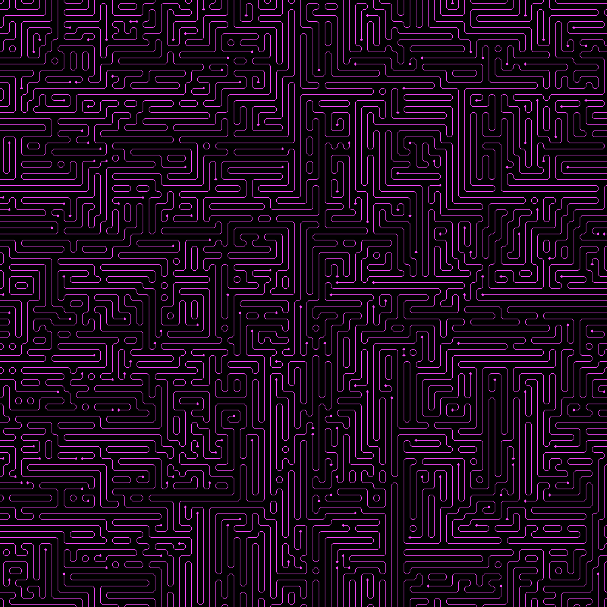

# Wave Function Collapse (WFC) Algorithm

This is an implementation of the Wave Function Collapse (WFC) algorithm in Python, based on the first half of Daniel Shiffman's video tutorial on the subject (https://youtu.be/rI_y2GAlQFM).



## Description

The Wave Function Collapse algorithm is used to generate tile-based patterns by propagating constraints through a grid of cells. Each cell has a set of possible tile states, and the algorithm collapses cells by eliminating incompatible states based on neighboring cells. The process continues until either all cells have collapsed or contradictions arise.

This implementation uses the Pygame library to provide a graphical representation of the generated patterns. The grid is displayed on a window, and the tiles are rendered as images.

## How to Run

1. Make sure you have Python and Pygame installed on your system.
2. Clone or download the code files to your local machine.
3. Open a terminal or command prompt and navigate to the directory containing the code files.
4. Run the following command to execute the program:
   ```
   python main.py
   ```
5. The generated patterns will be displayed in the Pygame window. Upon completion a screenshot of the result will be saved to the output folder.

## Controls

- Press the **Space** key to reset the board and generate a new pattern.
- Press the **Escape** key or click the **X** button to exit the program.

## Customization

You can customize the following parameters in the `main.py` file:

- `debug_mode`: Set to `True` to display debug information such as grid lines and possible tile states.
- `grid_size`: The size of the grid (number of cells per row and column).
- `weights`: weights to use when selecting a random tile

## Dependencies

This program requires the following dependencies:

- Python 3.x
- Pygame

## License

This project is provided without any specific license. You are free to use and modify the code for personal or educational purposes. However, please refer to the licenses of the dependencies (if any) for their usage terms.
